

  

<h1 align="center">Observing Network Traffic and Network Security Group (NSG) Functions Between Azure Virtual Machines</h1>

This project focuses on analyzing network traffic between two Azure virtual machines using Wireshark and PowerShell. It also demonstrates how Network Security Groups (NSGs) can control traffic flow between resources in a virtual network.

---

<h2>🧰 Prerequisite</h2>

- [Creating Virtual Machines in Azure](https://github.com/omeirnore/VirtualMachine-Creation)

---

<h2>🖥️ Environments and Tools Used</h2>

- Microsoft Azure (Virtual Machines, Networking, NSGs)
- Remote Desktop (RDP on Windows 11)
- PowerShell
- Wireshark (Network Protocol Analyzer)
- Protocols Observed: SSH, RDP, DNS, HTTP/S, ICMP, DHCP

---

<h2>🧑‍💻 Operating Systems Used</h2>

- Windows 11 (host system)
- Windows 10 Pro (22H2) [VM]
- Ubuntu Server 22.04 [VM]

---

<h2>🔌 Step 1: Connect to Windows VM and Install Wireshark</h2>

- Log in to the [Azure Portal](https://portal.azure.com/) and navigate to the **Virtual Machines** section.

- Start both the Windows and Linux VMs.  
  📌 *Note the public IP address of the Windows VM — you'll need it to connect via RDP.*

  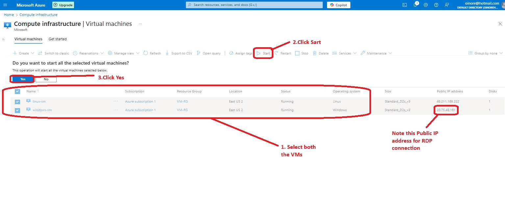

- Open the **Remote Desktop Connection** tool on your Windows 11 host system.

- In the **Computer** field, enter the public IP address of your Windows VM and click **Connect**.

  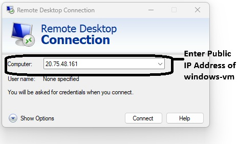

- Enter the **username and password** configured during VM setup.

  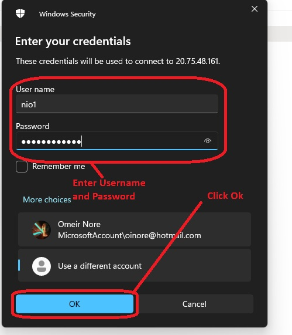

- Once connected, you'll have full access to your Windows VM:

  

- Open **Microsoft Edge** inside the VM and go to [Wireshark.org](https://www.wireshark.org).

- Download the **Windows x64 Installer**, run the setup, and complete installation using default options.

  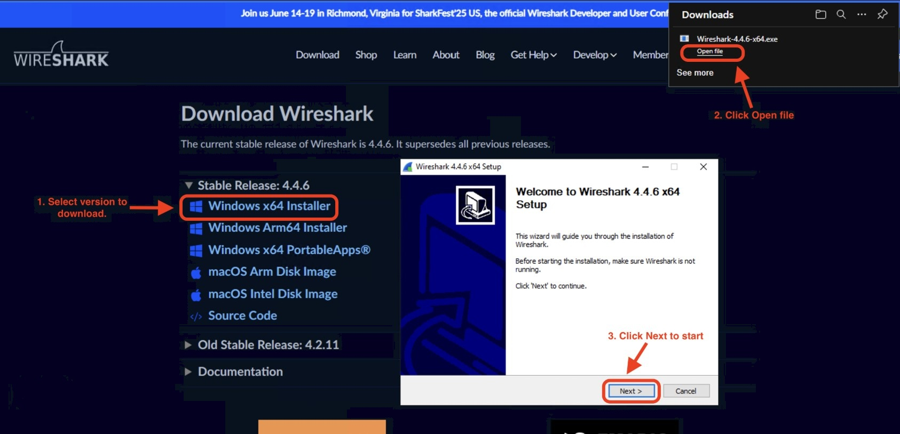

---

<h2>📡 Step 2: Monitor ICMP Traffic Between Virtual Machines</h2>

- Launch **Wireshark** inside the Windows VM.

- From the interface list, select the active **Ethernet adapter**, then click the **shark fin icon** to begin packet capture.

  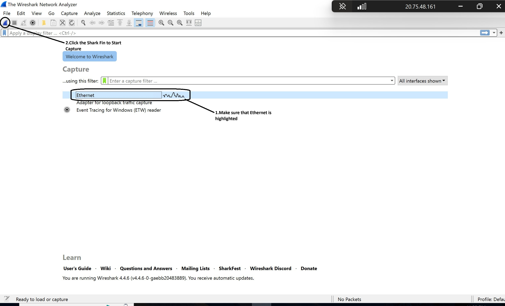

- In the **Wireshark filter bar**, type `icmp` and press **Enter** to display only ICMP packets (used by ping).

  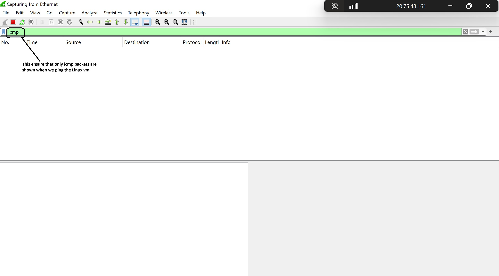

- Next in the Azure Portal, navigate to the **Linux VM**, select the **Networking** tab, and copy the **Private IP address**.

  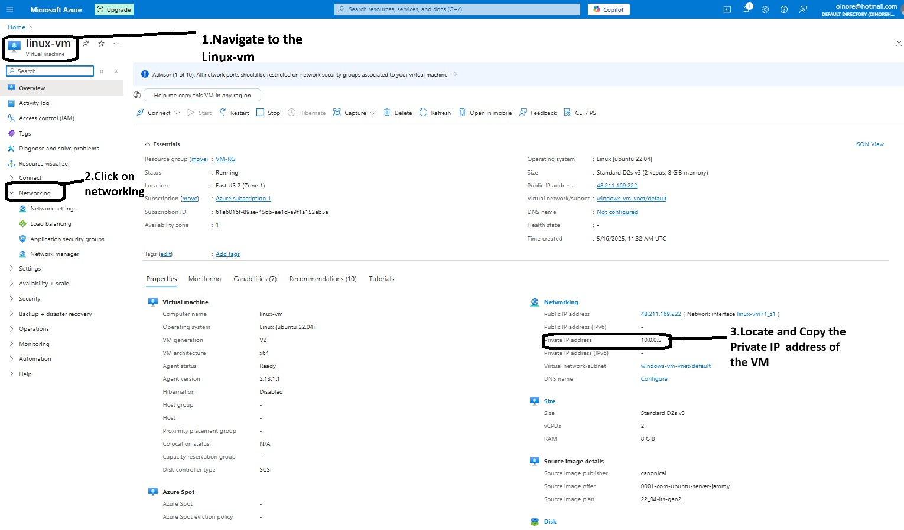

- Return to the windows VM, open **PowerShell**, and run the following command: `ping <Linux-Private-IP>`
- Once you run the ping command, you'll observe ICMP traffic flowing between the Windows and linux VMs which shows us our windows-vm (10.0.0.4) end the request to the linux-vm (10.0.0.5) and the linux-vm send a reply back to the winows-vm. Wireshark and PowerShell both show that we just successfully tested the connection between the two VMs.

<table>
  <tr>
    <td align="center"><strong>Opening PowerShell</strong></td>
    <td align="center"><strong>ICMP Traffic in Wireshark</strong></td>
    <td align="center"><strong>Output of Pinging linux-vm in PowerShell</strong></td>
  </tr>
  <tr>
    <td>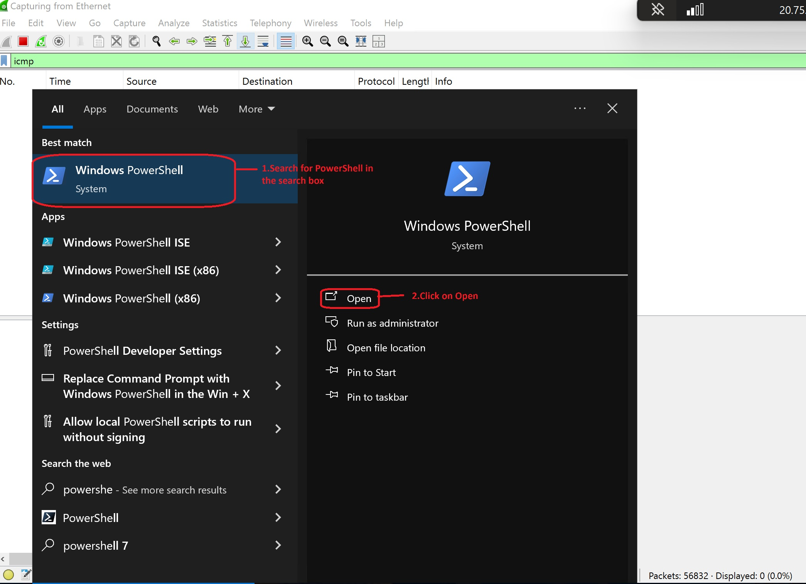</td>
    <td>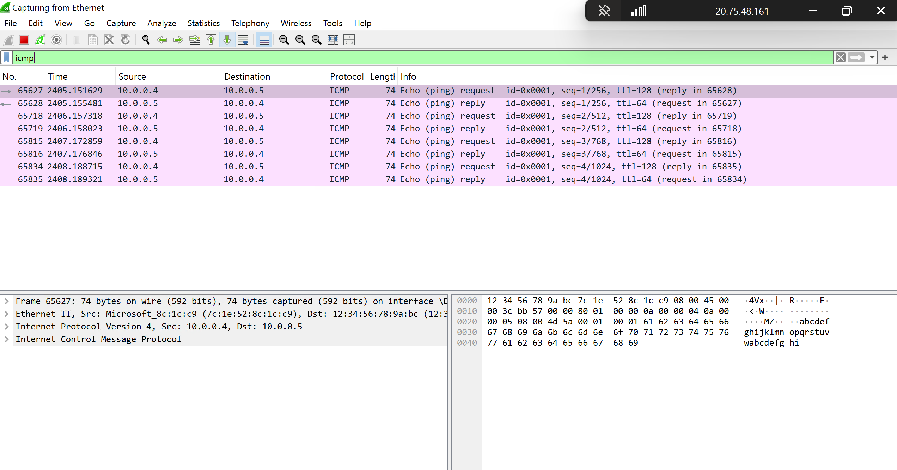</td>
    <td>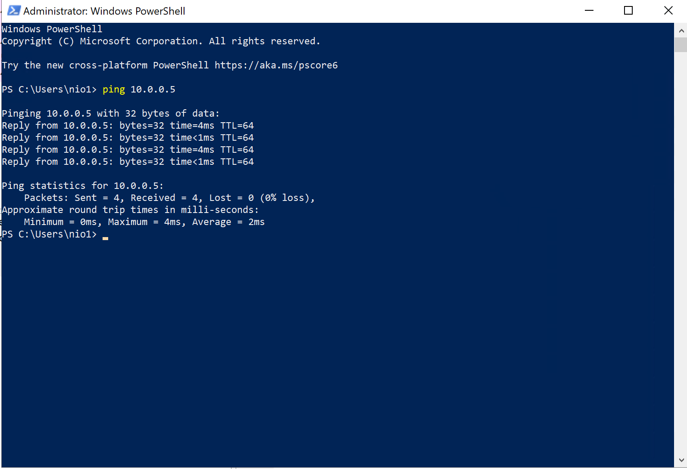</td>
  </tr>
</table>
- Now in PowerShell, initiate a perpetual ping to the linux-vm with the command ping 10.0.0.5 -t. This command tells the windows-vm to ping the linux-vm non-stop.

  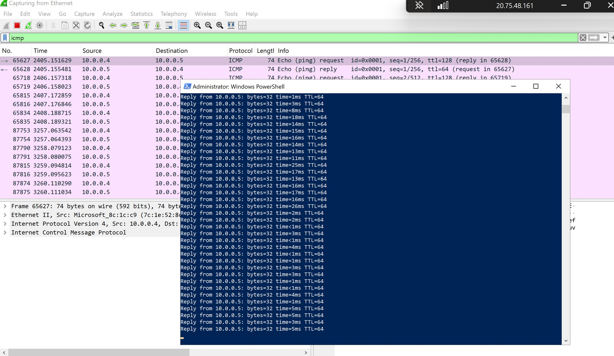

<h2>🛡️ Step 3: Block ICMP Traffic Using Network Security Group (NSG)</h2>

- While the continuous ping is running from the Windows VM to the Linux VM, head back to the **Azure Portal**.

- Navigate to the **Linux VM**, select the **Networking** tab, and click on the **Network Settings**, then you will be able to see the Network security group(usually named something like `linux-vm-nsg`).

  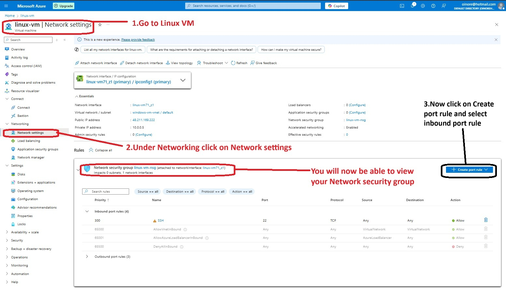

- Now click on **Create**, and choose **Inbound security rules**, then click **+ Add** to create a new rule.

- Fill in the rule as follows:
  - **Source**: Any  
  - **Source Port Ranges**: * (asterisk)  
  - **Destination**: Any  
  - **Destination Port Ranges**: * (asterisk)  
  - **Protocol**: ICMPv4
  - **Action**: Deny  
  - **Priority**: 290 (lower number = higher priority)  
  - **Name**: Deny-ICMP

  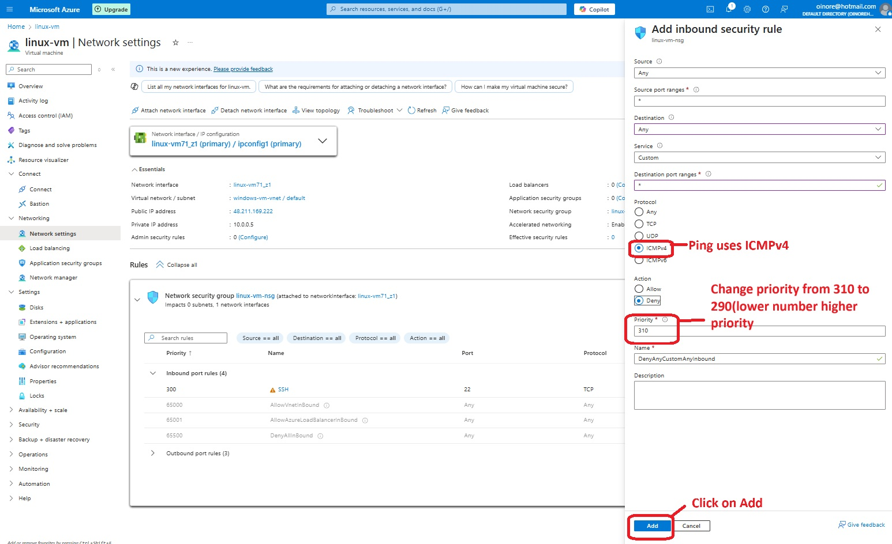

- Click **Add** to apply the rule.

- Once the rule is active, return to the Windows VM and observe the PowerShell ping output and Wireshark.  
  You'll start seeing **Request Timed Out** messages and ICMP packets being dropped.

<table>
  <tr>
    <td align="center"><strong>Ping Timeout in PowerShell</strong></td>
    <td align="center"><strong>ICMP Blocked in Wireshark</strong></td>
  </tr>
  <tr>
    <td>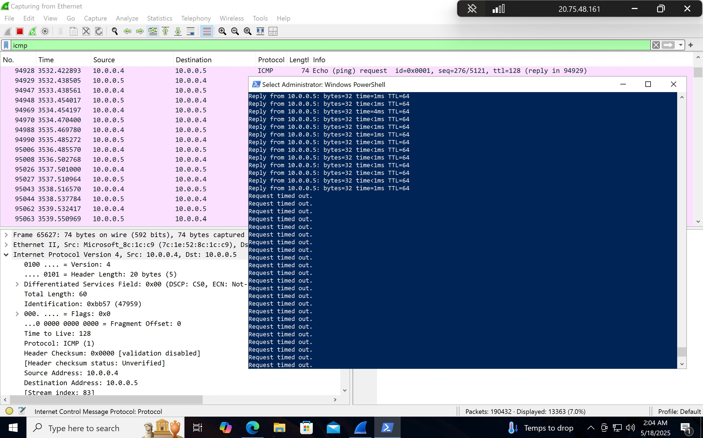</td>
    <td>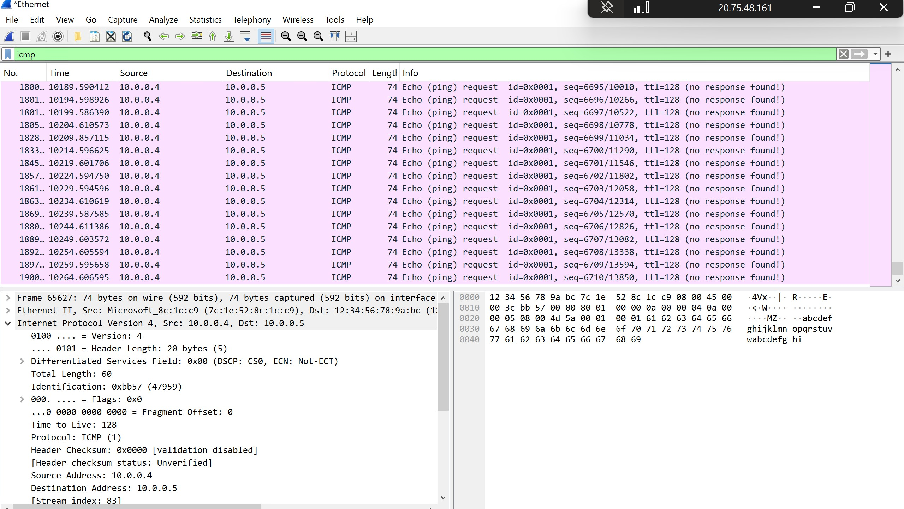</td>
  </tr>
</table>

> ✅ This demonstrates how Network Security Groups can enforce firewall rules at the subnet or VM level to block specific types of traffic, such as ICMP (used in ping).

<h2>🔄 Step 4: Remove NSG Rule and Resume ICMP Communication</h2>

- With the ICMP traffic currently blocked due to the NSG rule, we’ll now remove the rule and observe whether ping connectivity is restored.

- In the **Azure Portal**, return to the **Linux VM**'s **Networking** tab and open the **Network Security Group**.

- Under **Inbound security rules**, locate the rule you created earlier (e.g., `Deny-ICMP`) and click the **trash can icon** to delete it.

  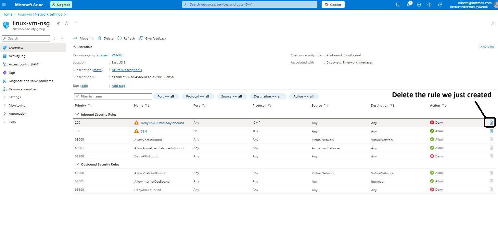

- Confirm the deletion when prompted by Azure.

- Once the rule is deleted, go back to your **Windows VM**.  
  You should immediately see that the ping replies from the Linux VM have resumed in **PowerShell**, and ICMP echo traffic is once again visible in **Wireshark**.

<table>
  <tr>
    <td align="center"><strong>ICMP Replies Resumed in PowerShell</strong></td>
    <td align="center"><strong>ICMP Replies Visible in Wireshark</strong></td>
  </tr>
  <tr>
    <td>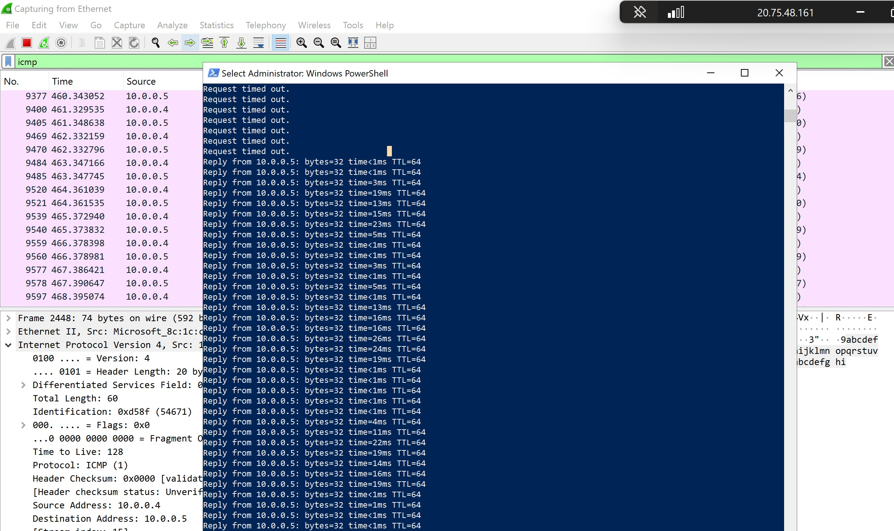</td>
    <td>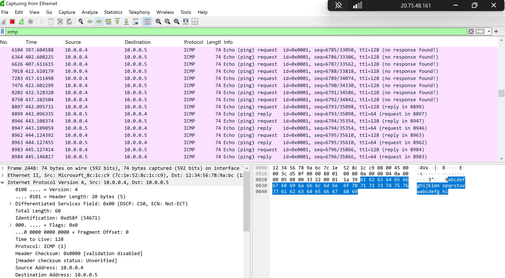</td>
  </tr>
</table>

- If the ping does not resume right away, wait 10–15 seconds, or manually stop and restart the ping process by pressing `Ctrl + C` in PowerShell and running the ping command again.

- You’ve now successfully demonstrated how **NSG rules can dynamically control traffic** between virtual machines, and how quickly those changes take effect in a live cloud environment.

> 💡 This hands-on verification is commonly used in real-world IT and cybersecurity roles to confirm firewall or routing changes in Azure environments.

