<p align="center">
  
</p>

<h1 align="center">Observing Network Traffic and Network Security Group (NSG) Functions Between Azure Virtual Machines</h1>

This project focuses on analyzing network traffic between two Azure virtual machines using Wireshark and PowerShell. It also demonstrates how Network Security Groups (NSGs) can control traffic flow between resources in a virtual network.

---

<h2>🧰 Prerequisite</h2>

- [Creating Virtual Machines in Azure](https://github.com/omeirnore/VirtualMachine-Creation)

---

<h2>🖥️ Environments and Tools Used</h2>

- Microsoft Azure (Virtual Machines, Networking, NSGs)
- Remote Desktop (RDP on Windows 11)
- PowerShell
- Wireshark (Network Protocol Analyzer)
- Protocols Observed: SSH, RDP, DNS, HTTP/S, ICMP, DHCP

---

<h2>🧑‍💻 Operating Systems Used</h2>

- Windows 11 (host system)
- Windows 10 Pro (22H2) [VM]
- Ubuntu Server 22.04 [VM]

---

<h2>🔌 Step 1: Connect to Windows VM and Install Wireshark</h2>

- Log in to the [Azure Portal](https://portal.azure.com/) and navigate to the **Virtual Machines** section.
- Start both the Windows and Linux VMs.  
  📌 *Note the public IP address of the Windows VM — you'll need it to connect via RDP.*

<p align="center">
  
</p>

- Open **Remote Desktop Connection** on your Windows 11 host.
- Enter the public IP of the Windows VM and click **Connect**.

<p align="center">
  
</p>

- Enter the login credentials created during VM setup.

<p align="center">
  
</p>

- You’ll now have access to the Windows VM desktop.

<p align="center">
  
</p>

- Open **Microsoft Edge** in the VM and download Wireshark from [Wireshark.org](https://www.wireshark.org).
- Install Wireshark using the default settings.

<p align="center">
  
</p>

---

<h2>📡 Step 2: Monitor ICMP Traffic Between Virtual Machines</h2>

- Launch **Wireshark** on the Windows VM.
- Select the active **Ethernet** adapter and click the **shark fin icon** to begin capturing.

<p align="center">
  
</p>

- Apply the filter `icmp` to isolate ICMP traffic.

<p align="center">
  
</p>

- In the Azure Portal, navigate to the Linux VM’s **Networking** tab and copy its **Private IP address**.

<p align="center">
  
</p>

- In PowerShell on the Windows VM, run: `ping <Linux-Private-IP>`

You’ll observe ICMP packets in Wireshark and replies in PowerShell, confirming successful communication between the two VMs.

<table>
  <tr>
    <td align="center"><strong>Opening PowerShell</strong></td>
    <td align="center"><strong>ICMP Traffic in Wireshark</strong></td>
    <td align="center"><strong>Ping Output in PowerShell</strong></td>
  </tr>
  <tr>
    <td></td>
    <td></td>
    <td></td>
  </tr>
</table>

- For continuous monitoring, run: `ping <Linux-Private-IP> -t`

<p align="center">
  
</p>

---

<h2>🛡️ Step 3: Block ICMP Traffic Using Network Security Group (NSG)</h2>

- While the continuous ping is running, open the **Linux VM > Networking > Network security group** in Azure.

<p align="center">
  
</p>

- Click **Inbound security rules > + Add**, and configure the following:

```
Source: Any
Source Port Ranges: *
Destination: Any
Destination Port Ranges: *
Protocol: ICMPv4
Action: Deny
Priority: 290
Name: Deny-ICMP
```

<p align="center">
  
</p>

- Return to the Windows VM — ping requests will now **time out** and ICMP traffic will stop.

<table>
  <tr>
    <td align="center"><strong>Ping Timeout in PowerShell</strong></td>
    <td align="center"><strong>ICMP Blocked in Wireshark</strong></td>
  </tr>
  <tr>
    <td></td>
    <td></td>
  </tr>
</table>

> ✅ NSGs act as firewalls at the VM or subnet level, allowing or denying traffic based on rules.

---

<h2>🔄 Step 4: Remove NSG Rule and Resume ICMP Communication</h2>

- In Azure, go back to the **Inbound rules** and delete the `Deny-ICMP` rule.

<p align="center">
  
</p>

- The ping will resume almost immediately in PowerShell and Wireshark.

<table>
  <tr>
    <td align="center"><strong>ICMP Replies in PowerShell</strong></td>
    <td align="center"><strong>ICMP Resumed in Wireshark</strong></td>
  </tr>
  <tr>
    <td></td>
    <td></td>
  </tr>
</table>

---

<h2>🔐 Step 5: Observe SSH and DHCP Traffic</h2>

### 🔸 Observe SSH Traffic

SSH (Secure Shell) is used to securely access Linux systems remotely over the network. In this step, we'll observe encrypted SSH packets between the Windows and Linux VMs.

- Open **Wireshark** and apply the filter: `ssh`. Then start a new packet capture session.
- On the Windows VM, open **PowerShell** and initiate a secure SSH session:

```powershell
ssh <username>@<Linux-Private-IP>
```

📌 Replace `<username>` and `<Linux-Private-IP>` with your actual Linux credentials.

- When prompted, type `yes` to confirm the connection, then enter the Linux VM password.

<p align="center">
  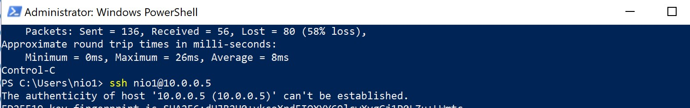
</p>

- You'll now be logged into the Linux VM via the terminal. Wireshark will display encrypted SSH traffic packets.

<p align="center">
  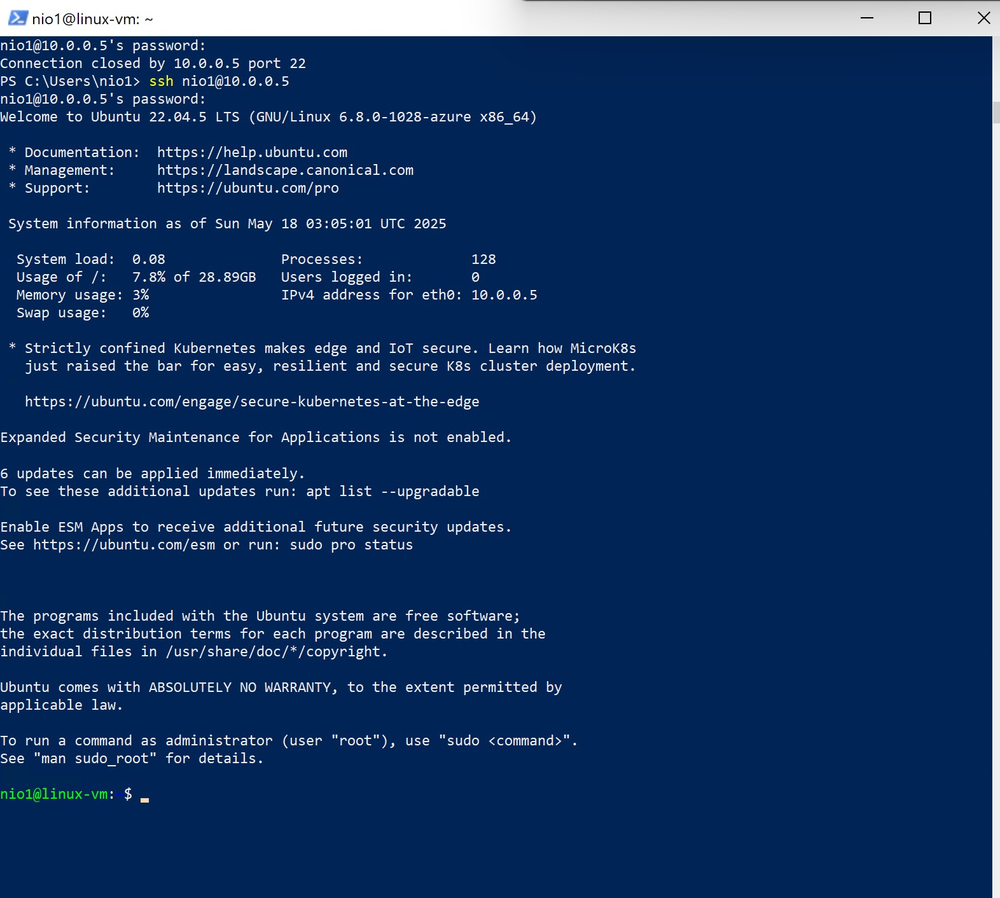
</p>

<p align="center">
  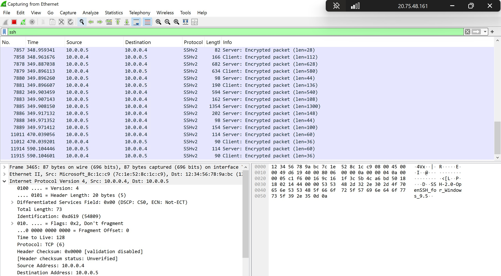
</p>

- Once done, type `exit` in PowerShell to close the SSH session.

> 🛡️ SSH encrypts both authentication and session data, making it ideal for secure system administration and data integrity.

---

### 🔸 Observe DHCP Traffic

DHCP (Dynamic Host Configuration Protocol) is used to assign dynamic IP addresses to devices. In Azure, VMs are assigned reserved dynamic IPs via DHCP.

Releasing an IP address manually using `ipconfig /release` can disconnect your RDP session. Instead, we’ll simulate DHCP traffic using a batch script that automates both release and renew operations.

#### 🛠️ Step-by-Step DHCP Simulation

1. **Open Notepad** in the Windows VM and write the following lines:

```plaintext
ipconfig /release
ipconfig /renew
```

2. **Save the file** as `dhcp.bat` in the path `C:\ProgramData`.

<p align="center">
  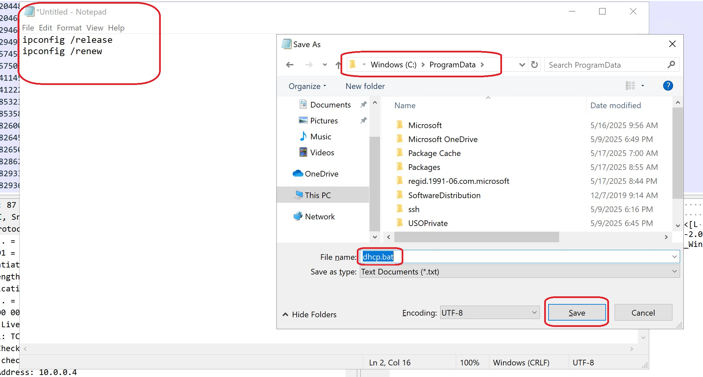
</p>

3. Open **Wireshark**, apply the filter: `dhcp`, and start a new capture.

<p align="center">
  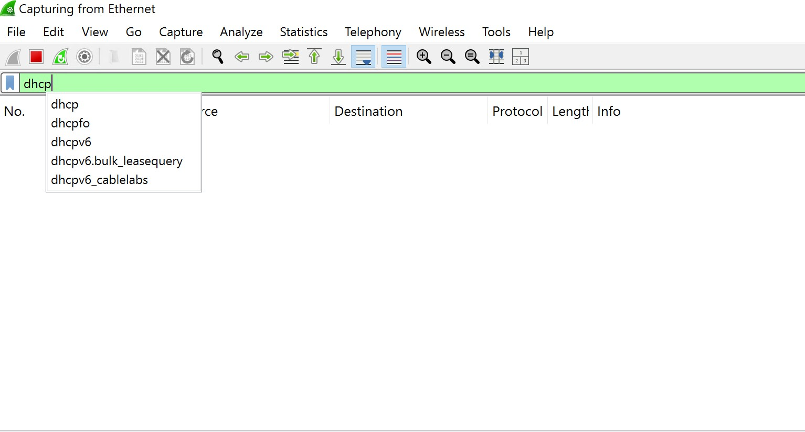
</p>

4. In **PowerShell**, navigate to the script location and execute it:

```powershell
cd C:\ProgramData
ls
.\dhcp.bat
```

<p align="center">
  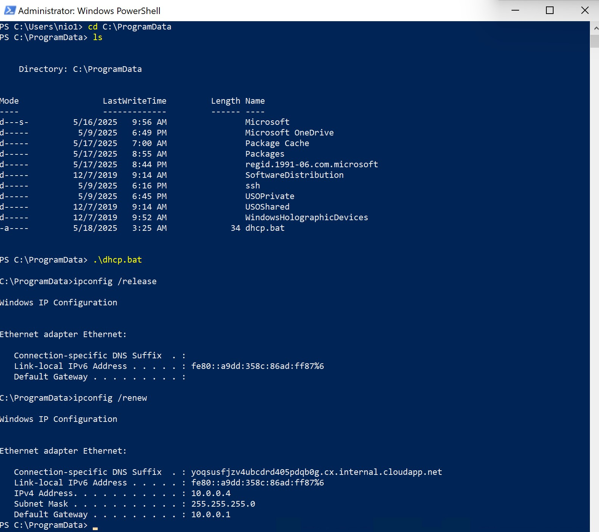
</p>

- During execution, the VM will momentarily release and renew its IP address. This activity will be captured as DHCP discover, offer, request, and acknowledgment packets in Wireshark.

<p align="center">
  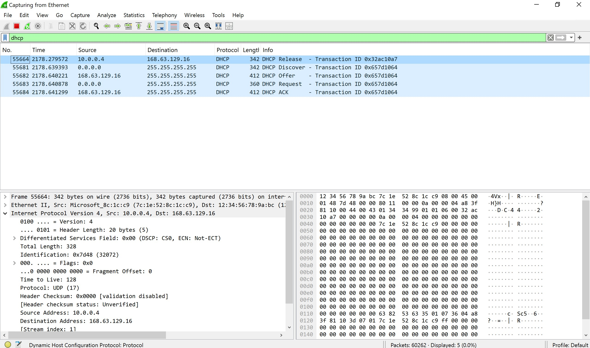
</p>

> 💡 This process demonstrates how DHCP leasing works behind the scenes in Azure, and provides hands-on experience with IP assignment protocols — a vital networking concept for cloud and security engineers.


<h2>🌐 Step 6: Analyze DNS and RDP Traffic</h2>

### 🔸 DNS Traffic

- In Wireshark, apply filter `dns` and run in PowerShell:  
  `nslookup disney.com`

<p align="center">
  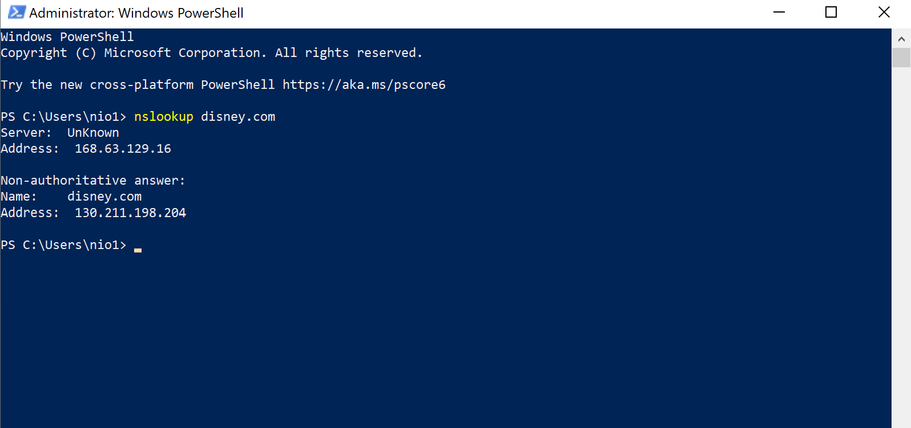
</p>

<p align="center">
  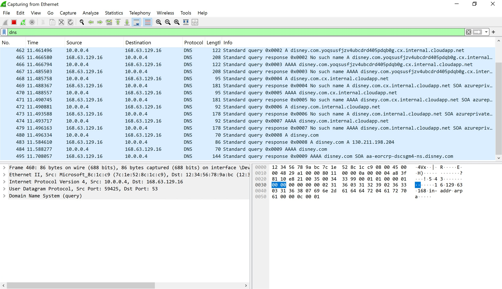
</p>

---

### 🔸 RDP Traffic

- Apply filter `tcp.port == 3389` in Wireshark.  
  You'll see consistent encrypted traffic during your RDP session.

<p align="center">
  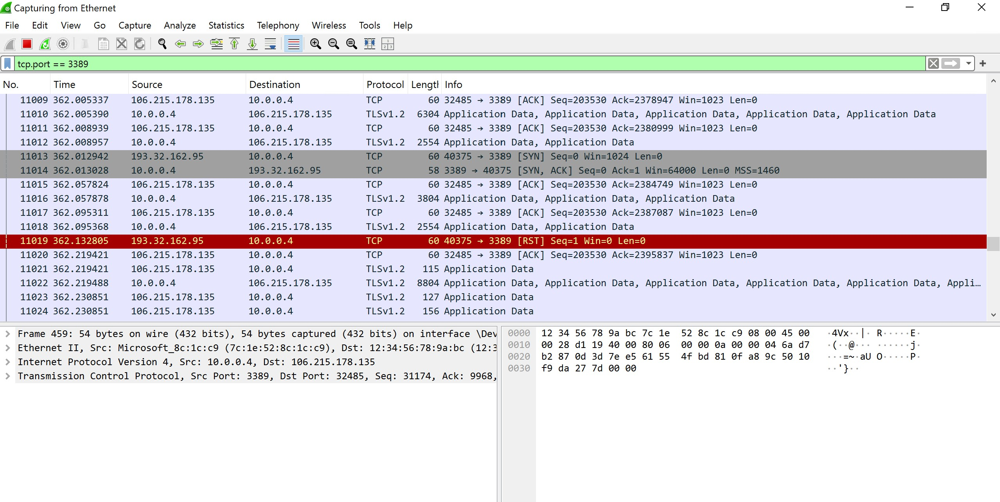
</p>

<p align="center">
  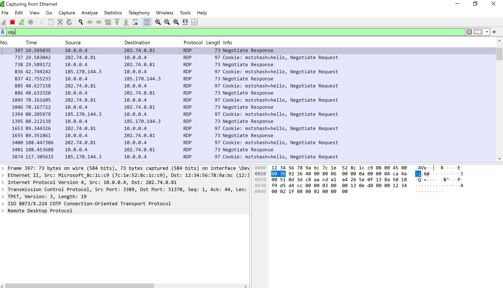
</p>

---

<h2>✅ Conclusion</h2>

In this project, we created two Azure virtual machines — one Windows and one Linux — and used them to explore and analyze real-time network traffic using Wireshark and PowerShell.

We examined protocols like **ICMP**, **SSH**, **RDP**, **DNS**, and **DHCP**, and tested how **Network Security Groups (NSGs)** control traffic flow between VMs.

This hands-on experience deepened our understanding of cloud networking, traffic analysis, and security rule implementation — all essential skills in IT and cybersecurity roles.

*Project by Omeir Nore*


